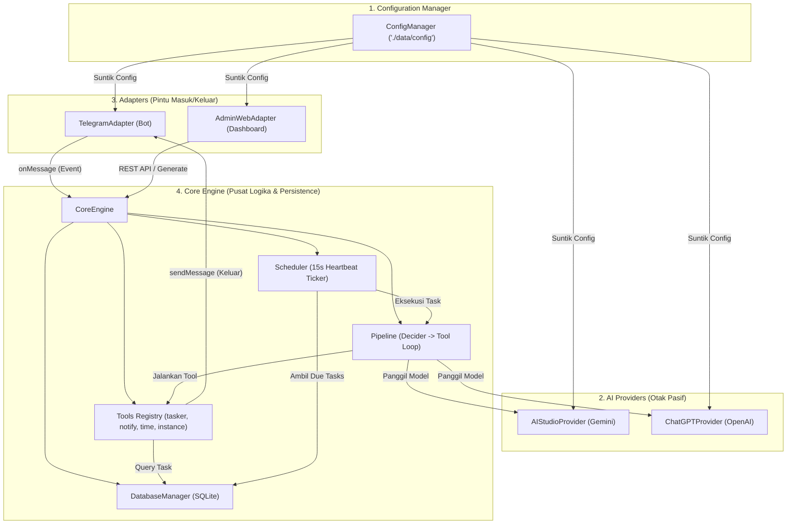
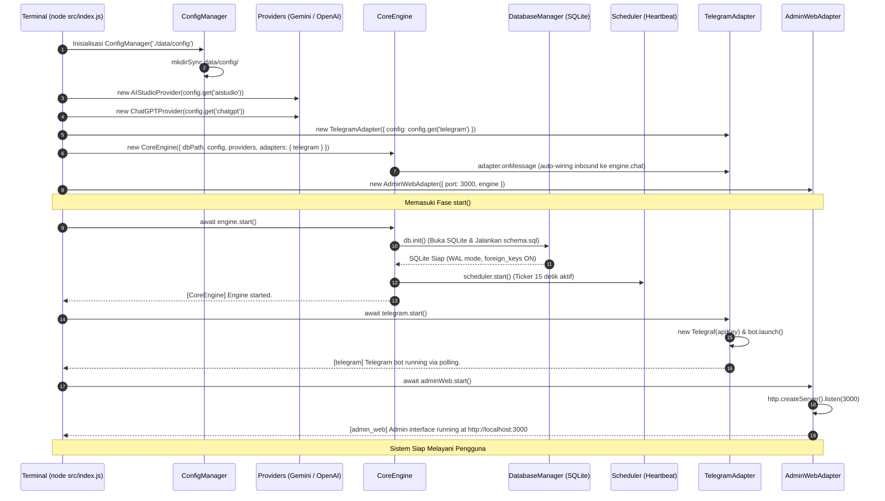
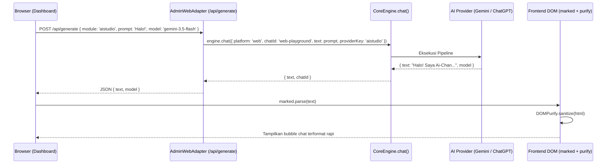

# KITAB ALUR SISTEM AI-CHAN (THE FLOW OF AI-CHAN)
## Panduan Arsitektur, Alur Eksekusi, dan Pengujian Fitur End-to-End

---

## DAFTAR ISI

1. [BAB 1: Anatomi dan Filosofi Arsitektur](#bab-1-anatomi-dan-filosofi-arsitektur)
   - 1.1 Mengapa Dibangun Ulang dari Awal?
   - 1.2 Peta Direktori `aichan-temp/`
   - 1.3 Empat Pilar Peran (Core, Providers, Adapters, Wiring)
2. [BAB 2: Cara Menyalakan Sistem (Booting & Lifecycle Sequence)](#bab-2-cara-menyalakan-sistem-booting--lifecycle-sequence)
   - 2.1 Perintah Startup
   - 2.2 Anatomi `src/index.js`: Komposisi Murni
   - 2.3 Rantai Booting: Dari File JSON hingga Listen Port
3. [BAB 3: Alur Sungai 1 — Pesan Masuk Reaktif (User Chat via Telegram)](#bab-3-alur-sungai-1--pesan-masuk-reaktif-user-chat-via-telegram)
   - 3.1 Deteksi Pesan di Adapter Telegram
   - 3.2 Penyerahan Pesan ke `CoreEngine.chat()`
   - 3.3 Perakitan Otomatis Objek `context`
   - 3.4 Eksekusi Pipeline Tahap 1 (The Decider)
   - 3.5 Pengembalian Jawaban dan Pengiriman Balasan
4. [BAB 4: Alur Sungai 2 — Eksekusi Tool (Tahap 2 Tool Loop)](#bab-4-alur-sungai-2--eksekusi-tool-tahap-2-tool-loop)
   - 4.1 Eskalasi dari Tahap 1 ke Tahap 2
   - 4.2 Siklus Iterasi Native Tool Call (Max 5 Loops)
   - 4.3 Registrasi dan Eksekusi Tool Lokal
   - 4.4 Kasus Nyata: Pemanggilan Tool `tasker` dan `get_current_time`
5. [BAB 5: Alur Sungai 3 — Detak Nadi Pasif & Notifikasi Keluar (Heartbeat & Proactive Pulse)](#bab-5-alur-sungai-3--detak-nadi-pasif--notifikasi-keluar-heartbeat--proactive-pulse)
   - 5.1 Ticker Latar Belakang `Scheduler`
   - 5.2 Pengambilan Tugas Jatuh Tempo (`getActiveDueTasks`)
   - 5.3 Pembangkitan Pipeline Mandiri
   - 5.4 Tool `send_notification`: Jalur Pesan Keluar
   - 5.5 Perbedaan Tugas `polling` vs `recurring`
6. [BAB 6: Alur Sungai 4 — Admin Web Dashboard & Testing Playground](#bab-6-alur-sungai-4--admin-web-dashboard--testing-playground)
   - 6.1 Arsitektur HTTP Server Mandiri (Port 3000)
   - 6.2 Penyajian Antarmuka Frontend & Library Vendor (`marked.js`, `purify.js`)
   - 6.3 Peta 14 Endpoint REST API
   - 6.4 AI Playground Testing: Dari Input Browser hingga Render Markdown
7. [BAB 7: Panduan Uji Coba Lapangan (Hands-on Verification Runbook)](#bab-7-panduan-uji-coba-lapangan-hands-on-verification-runbook)
   - 7.1 Menjalankan Rangkaian Unit & Smoke Test
   - 7.2 Menyalakan Sistem Penuh secara Live
   - 7.3 Menguji Fitur via Browser Dashboard
   - 7.4 Menguji Interaksi Chat & Task via Telegram

---

# BAB 1: ANATOMI DAN FILOSOFI ARSITEKTUR

### 1.1 Mengapa Dibangun Ulang dari Awal?
Pada implementasi lama (`aichan/`), sistem berkembang secara organik tanpa refaktorisasi berkala. Akibatnya terjadi tiga penyakit kronis:
1. **God Object `main`**: Berkas `main/index.js` mengimpor dan menduplikasi 35+ fungsi database, konfigurasi, pipeline AI, dan ticker heartbeat dalam 138 baris kode kotor.
2. **Leaky Abstraction pada Telegram**: Modul Telegram (yang seharusnya murni antarmuka chat) dipaksa memegang database (`storage: main`) hanya demi menjadi kurir pemanggil `runPipeline` dan menitipkan database ke tool AI.
3. **Self-Injection yang Ganjil**: Root `index.js` lama memanggil `main.startHeartbeat({ storage: main, runPipeline: main.runPipeline })`, di mana organ tubuh `main` dioper kembali ke dalam dirinya sendiri.

Arsitektur baru di `aichan-temp/` merombak total struktur ini dari *first principles*. Setiap modul hanya tahu tugasnya sendiri. Adapter tidak pernah melihat database, dan Core Engine mengorkestrasi segalanya secara internal.

---

### 1.2 Peta Direktori `aichan-temp/`

```text
E:\Ai-Chan\aichan-temp\
├── data/
│   ├── aichan.db                  <-- Database SQLite (6 tabel utama)
│   └── config/                    <-- Berkas konfigurasi modul JSON
│       ├── aistudio.json          <-- { "apiKey": "..." }
│       ├── chatgpt.json           <-- { "apiKey": "..." }
│       └── telegram.json          <-- { "apiKey": "...", "ownerId": "..." }
├── src/
│   ├── core/                      <-- Jantung Sistem (Core Engine)
│   │   ├── config/
│   │   │   └── index.js           <-- ConfigManager (Baca/Tulis JSON)
│   │   ├── database/
│   │   │   ├── schema.sql         <-- Skema 6 tabel SQLite
│   │   │   └── index.js           <-- DatabaseManager (CRUD Driver)
│   │   ├── pipeline/
│   │   │   └── index.js           <-- 2-Stage Orchestrator (Decider -> Tool Loop)
│   │   ├── scheduler/
│   │   │   └── index.js           <-- Heartbeat Ticker 15 Detik
│   │   ├── tools/
│   │   │   ├── definitions/       <-- Definisi Alat AI
│   │   │   │   ├── instance.js    <-- manage_instance
│   │   │   │   ├── notify.js      <-- send_notification
│   │   │   │   ├── tasker.js      <-- tasker (CRUD task)
│   │   │   │   └── time.js        <-- get_current_time
│   │   │   ├── registry.js        <-- Registry Skema Alat
│   │   │   └── index.js           <-- Eksekutor Alat
│   │   └── index.js               <-- CoreEngine Class (Pengendali Utama)
│   ├── providers/                 <-- Penyedia Otak AI
│   │   ├── aistudio.js            <-- Driver Google Gemini SDK (@google/genai)
│   │   └── chatgpt.js             <-- Driver OpenAI SDK (openai)
│   ├── adapters/                  <-- Saluran Masuk/Keluar (I/O)
│   │   ├── telegram.js            <-- Bot Telegram (Telegraf)
│   │   └── admin_web/             <-- Dashboard & REST API
│   │       ├── interface/         <-- File Frontend Web (HTML/CSS/JS)
│   │       │   ├── index.html
│   │       │   ├── script.js
│   │       │   └── style.css
│   │       └── index.js           <-- HTTP Server REST API (Port 3000)
│   └── index.js                   <-- Root Perakit Tunggal (Declarative Wiring)
├── tests/                         <-- Rangkaian Smoke Test Terisolasi
│   ├── check_syntax.js
│   ├── test_step3.js
│   ├── test_step4.js
│   ├── test_step5.js
│   ├── test_step6.js
│   ├── test_step7.js
│   └── test_step8_e2e.js
├── package.json                   <-- Dependensi Terpadu
├── architecture_blueprint.md      <-- Spesifikasi Kontrak
└── domain_inventory.md            <-- Sensus Fitur Baseline
```

---

### 1.3 Empat Pilar Peran



#### Pembedahan Mendalam Empat Pilar Sistem:

Arsitektur baru membagi sistem menjadi empat pilar dengan batas tanggung jawab yang sangat tegas (*Separation of Concerns*). Tidak ada lagi ketergantungan silang atau fungsi yang mencampurkan logika I/O dengan penyimpanan:

#### 1. Pilar Konfigurasi: [`ConfigManager`](file:///E:/Ai-Chan/aichan-temp/src/core/config/index.js)
* **Lokasi Berkas**: `src/core/config/index.js`
* **Tanggung Jawab**:
  * Menjadi satu-satunya gerbang pembacaan dan penyimpanan file konfigurasi JSON di dalam direktori `data/config/`.
  * Menjaga keamanan path dengan validasi regex nama modul (`/^[a-z0-9_-]+$/i`) agar tidak terjadi *directory traversal*.
  * Memastikan direktori target selalu dibuat otomatis (`mkdirSync` dengan opsi `recursive: true`).
  * Menyediakan nilai default bawaan secara aman saat file konfigurasi belum ada di disk, dan menggabungkan nilai disk di atas default (`{ ...defaults, ...JSON.parse(...) }`).
* **Input & Output**:
  * Metode `.get(moduleName, defaults)`: Menerima nama modul dan objek default, mengembalikan objek konfigurasi murni JavaScript.
  * Metode `.set(moduleName, config)`: Menerima nama modul dan data baru, menuliskan kembali ke disk dalam format JSON berindentasi 2 spasi secara sinkron, lalu mengembalikan data terbarukan.
* **Peran Alur**: Dipanggil paling pertama pada saat *root startup* untuk menyuplai API key dan konfigurasi port ke seluruh modul lainnya tanpa modul-modul tersebut perlu menyentuh modul `fs` secara manual.

#### 2. Pilar Penyedia Otak AI: Providers ([`src/providers/`](file:///E:/Ai-Chan/aichan-temp/src/providers/))
* **Lokasi Berkas**:
  * Driver Google Gemini: [`src/providers/aistudio.js`](file:///E:/Ai-Chan/aichan-temp/src/providers/aistudio.js) (`AIStudioProvider`)
  * Driver OpenAI: [`src/providers/chatgpt.js`](file:///E:/Ai-Chan/aichan-temp/src/providers/chatgpt.js) (`ChatGPTProvider`)
* **Filosofi Desain (Otak Pasif)**:
  * Provider dirancang sebagai modul pasif murni (*passive stateless worker*). Provider sama sekali **tidak tahu** apa itu database SQLite, tidak tahu apa itu Telegraf Telegram, tidak tahu apa itu Web Dashboard, dan tidak tahu apa itu tugas latar belakang (*scheduler tasks*).
  * Tugas provider murni menerjemahkan kontrak baku Ai-Chan ke dalam format panggilan SDK vendor (`@google/genai` untuk Google Gemini, dan `openai` untuk OpenAI).
* **Empat Kontrak Metode Wajib**:
  1. `generateText({ prompt, model, systemPrompt })`: Menghasilkan teks tunggal sederhana tanpa struktur JSON khusus.
  2. `generateStructured({ prompt, model, history, schema, systemPrompt })`: Menghasilkan output terstruktur yang dijamin mematuhi skema JSON (digunakan pada Evaluasi Tahap 1 / Decider).
  3. `generateWithNativeTools({ model, systemPrompt, messages, tools })`: Mengirimkan daftar definisi tool ke model AI menggunakan fitur native tool calling, lalu mengembalikan status `{ isFinal: boolean, text?: string, toolCalls?: Array }`.
  4. `listModels()`: Mengambil daftar model yang didukung secara dinamis langsung dari API penyedia AI.

#### 3. Pilar Pintu Masuk/Keluar: Adapters ([`src/adapters/`](file:///E:/Ai-Chan/aichan-temp/src/adapters/))
* **Lokasi Berkas**:
  * Antarmuka Telegram: [`src/adapters/telegram.js`](file:///E:/Ai-Chan/aichan-temp/src/adapters/telegram.js) (`TelegramAdapter`)
  * Antarmuka Admin Web: [`src/adapters/admin_web/index.js`](file:///E:/Ai-Chan/aichan-temp/src/adapters/admin_web/index.js) (`AdminWebAdapter`)
* **Filosofi Desain (Zero Database Access)**:
  * Berbeda 180 derajat dari sistem lama di mana adapter Telegram dipaksa mengelola database (`storage`), adapter baru adalah murni gerbang I/O jaringan (*network boundary*).
  * **TelegramAdapter**:
    * Pintu Masuk: Menangkap pesan pengguna melalui mekanisme long-polling Telegraf pada event `bot.on('text')`, mengekstrak string `chatId` dan `text`, lalu meneruskannya ke callback terdaftar (`this.messageHandler`).
    * Pintu Keluar: Menyediakan fungsi `sendMessage(chatId, text)` yang dapat dipanggil kapan saja oleh sistem luar (misalnya oleh tool notifikasi atau scheduler) untuk mengirimkan teks ke chat Telegram tertentu.
  * **AdminWebAdapter**:
    * Menyajikan frontend mandiri menggunakan server native `node:http` pada port 3000 tanpa framework eksternal yang membengkak.
    * Menyajikan berkas antarmuka statis ([`index.html`](file:///E:/Ai-Chan/aichan-temp/src/adapters/admin_web/interface/index.html), [`style.css`](file:///E:/Ai-Chan/aichan-temp/src/adapters/admin_web/interface/style.css), [`script.js`](file:///E:/Ai-Chan/aichan-temp/src/adapters/admin_web/interface/script.js)) serta pustaka vendor yang dipetakan dari `node_modules` ([`marked.js`](file:///E:/Ai-Chan/aichan-temp/node_modules/marked/lib/marked.umd.js) untuk Markdown dan [`purify.js`](file:///E:/Ai-Chan/aichan-temp/node_modules/dompurify/dist/purify.min.js) untuk sanitasi XSS).
    * Menyediakan 14 endpoint REST API untuk memantau status modul, mengelola database chat dan prompt, memperbarui konfigurasi API key secara langsung di memori dan disk, serta menyediakan interactive AI testing playground.

#### 4. Pilar Inti Pengendali: Core Engine ([`src/core/`](file:///E:/Ai-Chan/aichan-temp/src/core/))
* **Lokasi Berkas**:
  * Orkes Utama: [`src/core/index.js`](file:///E:/Ai-Chan/aichan-temp/src/core/index.js) (`CoreEngine`)
  * Database & Persistence: [`src/core/database/index.js`](file:///E:/Ai-Chan/aichan-temp/src/core/database/index.js) (`DatabaseManager`)
  * Registrasi & Eksekusi Alat: [`src/core/tools/`](file:///E:/Ai-Chan/aichan-temp/src/core/tools/) (`ToolsRegistry` & `executeTool`)
  * Orkestrasi Pipeline 2 Tahap: [`src/core/pipeline/index.js`](file:///E:/Ai-Chan/aichan-temp/src/core/pipeline/index.js) (`runPipeline`)
  * Detak Nadi Terjadwal: [`src/core/scheduler/index.js`](file:///E:/Ai-Chan/aichan-temp/src/core/scheduler/index.js) (`Scheduler`)
* **Tanggung Jawab & Mekanisme Kerja**:
  * Bertindak sebagai *composition root* internal yang membungkus database, pendaftaran alat fisik, penjadwal latar belakang, dan alur eksekusi pipeline.
  * Menerima penyedia AI (`providers`) dan adapter I/O (`adapters`) melalui *dependency injection* di constructor.
  * Mengeliminasi *leaky abstraction*: Setiap kali pesan masuk diproses melalui `engine.chat()`, Core Engine secara otomatis merakit objek `context` yang berisi referensi `storage: this.database` dan `adapters: this.adapters`. Dengan demikian, alat fisik (seperti `tasker` atau `send_notification`) dapat mengakses database dan saluran pesan keluar tanpa perlu adapter luar mengetahui struktur internal tersebut.
  * Mengelola siklus hidup (*lifecycle*): Memastikan database SQLite dibuka dengan mode WAL dan pengaktifan Foreign Keys sebelum komponen lain berjalan, serta menghidupkan timer scheduler secara teratur.

---

# BAB 2: CARA MENYALAKAN SISTEM (BOOTING & LIFECYCLE SEQUENCE)

### 2.1 Perintah Startup
Cara resmi dan semestinya untuk menyalakan sistem Ai-Chan baru adalah menjalankan perintah berikut dari root direktori `aichan-temp/`:

```powershell
node src/index.js
```

Tidak ada lagi file launcher terpisah atau urutan manual yang membingungkan. Berkas `src/index.js` bertindak sebagai *single entry point* yang mengorkestrasi inisialisasi seluruh komponen dalam urutan yang tepat.

---

### 2.2 Anatomi `src/index.js`: Komposisi Murni

Mari kita bedah kode aktual di [`src/index.js`](file:///E:/Ai-Chan/aichan-temp/src/index.js):

```javascript
import path from 'node:path';
import { fileURLToPath } from 'node:url';
import { ConfigManager } from './core/config/index.js';
import { CoreEngine } from './core/index.js';
import { AIStudioProvider } from './providers/aistudio.js';
import { ChatGPTProvider } from './providers/chatgpt.js';
import { TelegramAdapter } from './adapters/telegram.js';
import { AdminWebAdapter } from './adapters/admin_web/index.js';

const rootDir = path.resolve(path.dirname(fileURLToPath(import.meta.url)), '..');
const configDir = path.join(rootDir, 'data', 'config');
const dbPath = path.join(rootDir, 'data', 'aichan.db');

// 1. Manajer Konfigurasi Terpusat
export const config = new ConfigManager(configDir);

// 2. Multi-Provider AI (Gemini & OpenAI)
export const providers = {
  aistudio: new AIStudioProvider(config.get('aistudio')),
  chatgpt: new ChatGPTProvider(config.get('chatgpt'))
};

// 3. Adapters I/O (Telegram Bot)
export const telegram = new TelegramAdapter({ config: config.get('telegram') });

// 4. Core Engine Terpadu
export const engine = new CoreEngine({
  dbPath,
  config,
  providers,
  defaultProviderKey: 'aistudio',
  adapters: { telegram }
});

// 5. Admin Web Dashboard
export const adminWeb = new AdminWebAdapter({
  config: config.get('admin_web', { port: 3000 }),
  engine
});

// 6. Lifecycle Kontrol Sistem
export async function start() {
  console.log('[Ai-Chan] Starting Clean Architecture System...');
  await engine.start();
  await telegram.start();
  await adminWeb.start();
  console.log('[Ai-Chan] System is fully online and ready.');
}
```

#### Pembedahan Baris demi Baris & Analisis Komposisi:

1. **Resolusi Direktori ESM (Baris 1-13)**:
   * Menggunakan pustaka native `node:path` dan `node:url`.
   * Pada lingkungan ES Modules (`"type": "module"`), variabel global CommonJS seperti `__dirname` dan `__filename` tidak tersedia. Baris `fileURLToPath(import.meta.url)` menerjemahkan URL berkas saat ini menjadi path absolut sistem operasi lokal (misal: `E:\Ai-Chan\aichan-temp\src\index.js`).
   * `path.resolve(..., '..')` melangkah satu tingkat ke atas untuk memperoleh direktori akar proyek `rootDir` (`E:\Ai-Chan\aichan-temp`).
   * Dua path vital ditetapkan: `configDir` (`data/config`) dan `dbPath` (`data/aichan.db`).

2. **Blok 1 — Manajer Konfigurasi Terpusat (Baris 16)**:
   * `export const config = new ConfigManager(configDir);`
   * Komponen pertama yang wajib diinstansiasi. Manajer ini langsung memastikan direktori `data/config` tersedia di disk (`mkdirSync`).
   * Setiap modul downstream cukup meminta konfigurasi miliknya melalui `config.get('nama_modul')` tanpa perlu menyentuh sistem file (`fs`) secara independen.

3. **Blok 2 — Kamus Multi-Provider AI (Baris 19-22)**:
   * `export const providers = { aistudio: ..., chatgpt: ... };`
   * Kedua penyedia otak AI (Google Gemini dan OpenAI) diinstansiasi dengan menyuntikkan konfigurasi masing-masing (`config.get('aistudio')` dan `config.get('chatgpt')`).
   * Keduanya disimpan dalam satu objek kamus (*dictionary*) yang dipetakan berdasarkan kata kunci (`'aistudio'` dan `'chatgpt'`). Ini memungkinkan sistem berganti-ganti model secara dinamis saat runtime hanya dengan menyebutkan nama kuncinya.

4. **Blok 3 — Adapter Input/Output Telegram (Baris 24)**:
   * `export const telegram = new TelegramAdapter({ config: config.get('telegram') });`
   * **Perhatikan secara cermat apa yang TIDAK dioper ke Telegram**: Adapter ini tidak menerima parameter database, tidak menerima fungsi pipeline, dan tidak menerima instance engine.
   * Telegram Adapter murni hanya menerima konfigurasi tokennya. Hal ini memotong total *leaky abstraction* yang sebelumnya merusak sistem lama.

5. **Blok 4 — Inisialisasi Core Engine Terpadu & Auto-Wiring Inbound (Baris 27-33)**:
   * `export const engine = new CoreEngine({ dbPath, config, providers, defaultProviderKey: 'aistudio', adapters: { telegram } });`
   * Di sinilah *Inversion of Control (IoC)* dan *Auto-Wiring* terjadi. CoreEngine menerima seluruh organ: jalur database SQLite, manajer konfigurasi, kamus provider AI, dan adapter (`adapters: { telegram }`).
   * Di dalam konstruktor `CoreEngine`, setiap adapter langsung diikat secara otomatis ke method `this.chat()`:
     ```javascript
     for (const [platform, adapter] of Object.entries(this.adapters)) {
       adapter.onMessage(async ({ chatId, text }) => {
         return await this.chat({ platform, chatId, text });
       });
     }
     ```
   * **Nol Jahitan Manual**: Di `src/index.js`, Anda tidak perlu lagi menulis `telegram.onMessage(...)` secara manual. Semua adapter yang didaftarkan langsung aktif dua arah (menerima pesan masuk dan mengirim notifikasi keluar).

6. **Blok 5 — Antarmuka Web Dashboard (Baris 36-39)**:
   * `export const adminWeb = new AdminWebAdapter({ config: config.get('admin_web', { port: 3000 }), engine });`
   * Menyambungkan server HTTP Dashboard ke `engine`. Melalui instansi engine ini, Web Dashboard dapat mengakses log percakapan di database, memicu testing playground, dan mengatur kepribadian sistem.

7. **Blok 6 — Siklus Hidup Tunggal `start()` (Baris 42-48)**:
   * Fungsi ini mengeksekusi tiga tahapan penyalaan sistem secara teratur:
     1. `await engine.start()`: Menyiapkan database SQLite dan mengaktifkan timer scheduler heartbeat.
     2. `await telegram.start()`: Melakukan koneksi bot Telegram ke server cloud via long-polling.
     3. `await adminWeb.start()`: Membuka listen port 3000 pada server HTTP lokal.
   * Rantai booting sekuensial ini menjamin bahwa seluruh persistensi dan logika internal telah 100% siap sebelum gerbang jaringan luar (Telegram & HTTP) mulai menerima request masuk.

---

### 2.3 Rantai Booting: Dari File JSON hingga Listen Port

Ketika Anda mengetik `node src/index.js`, urutan eksekusi terjadi sebagai berikut:



#### Rincian Langkah Sekuensial Rantai Booting dengan Cuplikan Kode Sumber:

Mari kita telusuri secara konkret baris kode yang dieksekusi pada setiap tahap sequence di atas:

#### Langkah 1: Pemuatan Konfigurasi oleh [`ConfigManager`](file:///E:/Ai-Chan/aichan-temp/src/core/config/index.js)
Saat `src/index.js` dievaluasi, `ConfigManager` membaca berkas JSON di direktori `data/config/`:
```javascript
// Di src/core/config/index.js:
constructor(configDir = './data/config') {
  this.configDir = path.resolve(configDir);
  this.init(); // Memastikan folder data/config/ tercipta via fs.mkdirSync
}

get(moduleName, defaults = {}) {
  // Validasi regex nama modul
  if (!/^[a-z0-9_-]+$/i.test(moduleName)) throw new Error(...);
  const filePath = path.join(this.configDir, `${moduleName}.json`);
  if (!fs.existsSync(filePath)) return { ...defaults };
  return { ...defaults, ...JSON.parse(fs.readFileSync(filePath, 'utf8')) };
}
```
Hasil pemanggilan `config.get('aistudio')`, `config.get('chatgpt')`, dan `config.get('telegram')` menghasilkan objek konfigurasi JavaScript murni yang siap disuntikkan ke provider dan adapter.

#### Langkah 2: Inisialisasi Klien SDK pada Providers
Penyedia AI menginisialisasi pustaka SDK resmi menggunakan API key yang diterima:
* **Google Gemini** ([`src/providers/aistudio.js`](file:///E:/Ai-Chan/aichan-temp/src/providers/aistudio.js)):
  ```javascript
  constructor(config = {}) {
    this.configure(config);
  }
  configure(config = {}) {
    this.apiKey = config.apiKey || process.env.GEMINI_API_KEY || '';
    this.client = this.apiKey ? new GoogleGenAI({ apiKey: this.apiKey }) : null;
  }
  ```
* **OpenAI** ([`src/providers/chatgpt.js`](file:///E:/Ai-Chan/aichan-temp/src/providers/chatgpt.js)):
  ```javascript
  constructor(config = {}) {
    this.configure(config);
  }
  configure(config = {}) {
    this.apiKey = config.apiKey || process.env.OPENAI_API_KEY || '';
    this.client = this.apiKey ? new OpenAI({ apiKey: this.apiKey }) : null;
  }
  ```

#### Langkah 3: Inisialisasi Adapter I/O Jaringan
* **TelegramAdapter** ([`src/adapters/telegram.js`](file:///E:/Ai-Chan/aichan-temp/src/adapters/telegram.js)):
  ```javascript
  constructor({ config = {} } = {}) {
    this.config = config;
    this.bot = null;
    this.messageHandler = null;
  }
  ```
  Pada titik ini, bot Telegram belum tersambung ke jaringan (*lazy connection*), hanya menyimpan konfigurasi dan menyiapkan variabel penampung handler.
* **AdminWebAdapter** ([`src/adapters/admin_web/index.js`](file:///E:/Ai-Chan/aichan-temp/src/adapters/admin_web/index.js)):
  ```javascript
  constructor({ config = {}, engine } = {}) {
    this.config = config;
    this.port = Number(config.port) || 3000;
    this.engine = engine;
    this.server = null;
  }
  ```
  AdminWebAdapter menerima referensi `engine` dan menentukan port HTTP (default 3000).

#### Langkah 4: Inisialisasi `CoreEngine` & Sub-Komponen Internal
Di [`src/core/index.js`](file:///E:/Ai-Chan/aichan-temp/src/core/index.js):
```javascript
constructor({ dbPath, config, providers = {}, defaultProviderKey = 'aistudio', adapters = {} }) {
  this.dbPath = dbPath;
  this.config = config;
  this.providers = providers;
  this.defaultProviderKey = defaultProviderKey;
  this.adapters = adapters;

  // Inisialisasi Database SQLite Manager
  this.database = new DatabaseManager(this.dbPath);

  // Inisialisasi Heartbeat Scheduler
  this.scheduler = new Scheduler({
    database: this.database,
    runPipeline: (args) => runPipeline(args),
    getProvider: () => this.getDefaultProvider(),
    getAdapters: () => this.adapters,
    intervalMs: 15000
  });
}
```

#### Langkah 5: Eksekusi `await engine.start()` (Pondasi SQLite & Ticker)
Fungsi `start()` di [`src/core/index.js`](file:///E:/Ai-Chan/aichan-temp/src/core/index.js) dipanggil:
```javascript
async start() {
  this.database.init();
  this.scheduler.start();
  console.log('[CoreEngine] Engine started.');
}
```
Di dalam `this.database.init()` ([`src/core/database/index.js`](file:///E:/Ai-Chan/aichan-temp/src/core/database/index.js)):
1. Membuka koneksi `better-sqlite3`: `this.db = new Database(this.databasePath);`
2. Mengaktifkan integritas relasi: `this.db.pragma('foreign_keys = ON');`
3. Mengaktifkan mode konkurensi tinggi: `this.db.pragma('journal_mode = WAL');`
4. Membaca dan mengeksekusi DDL [`schema.sql`](file:///E:/Ai-Chan/aichan-temp/src/core/database/schema.sql) untuk memastikan 6 tabel (`chats`, `messages`, `tasks`, `system_prompts`, `model_capabilities`, `settings`) tercipta.
5. Memasukkan (*seed*) kepribadian bawaan `default_assistant` jika belum ada:
   ```sql
   INSERT OR IGNORE INTO system_prompts (codename, content, description)
   VALUES ('default_assistant', 'You are Ai-Chan, a helpful AI assistant.', 'Default system prompt');
   ```
6. Selanjutnya, `this.scheduler.start()` mengaktifkan ticker timer `setInterval` setiap 15.000 milidetik (15 detik) untuk mengecek tugas jatuh tempo di latar belakang.

#### Langkah 6: Eksekusi `await telegram.start()` (Koneksi Bot Cloud)
Di [`src/adapters/telegram.js`](file:///E:/Ai-Chan/aichan-temp/src/adapters/telegram.js):
```javascript
async start() {
  const token = this.config.apiKey;
  if (!token) {
    console.warn('[telegram] Bot token missing; skipping Telegram start.');
    return;
  }
  this.bot = new Telegraf(token);

  // Mendaftarkan event text listener
  this.bot.on('text', async (ctx) => { ... });

  // Memulai proses long-polling secara asinkron tanpa memblokir thread
  this.bot.launch().catch(err => {
    console.error('[telegram] Bot launch error:', err.message);
  });
  console.log('[telegram] Telegram bot running via polling.');
}
```
Bot kini aktif terhubung ke server Telegram dan siap menangkap pesan dari pengguna Telegram.

#### Langkah 7: Eksekusi `await adminWeb.start()` (Listen HTTP Port 3000)
Di [`src/adapters/admin_web/index.js`](file:///E:/Ai-Chan/aichan-temp/src/adapters/admin_web/index.js):
```javascript
async start() {
  if (this.server) return;
  return new Promise((resolve) => {
    this.server = http.createServer((req, res) => {
      this.handleRequest(req, res);
    });

    this.server.listen(this.port, () => {
      console.log(`[admin_web] Admin interface running at http://localhost:${this.port}`);
      resolve();
    });
  });
}
```
Server HTTP lokal terbuka pada port 3000. Seluruh sistem kini berstatus **ONLINE** dan siap melayani permintaan baik dari Telegram maupun browser.

---

# BAB 3: ALUR SUNGAI 1 — PESAN MASUK REAKTIF (USER CHAT VIA TELEGRAM)

Mari kita telusuri skenario paling umum: **User mengirim pesan percakapan biasa (tanpa butuh tools)**.

Contoh pesan pengguna di Telegram:
> *"Halo Ai-Chan, perkenalkan dirimu dan apa tugasmu?"*

---

### 3.1 Deteksi Pesan di Adapter Telegram
Di dalam [`src/adapters/telegram.js`](file:///E:/Ai-Chan/aichan-temp/src/adapters/telegram.js):

```javascript
// Baris 35-51
this.bot.on('text', async (ctx) => {
  const chatId = String(ctx.chat.id);
  const text = ctx.message.text;

  if (this.messageHandler) {
    try {
      const result = await this.messageHandler({ chatId, text });
      if (result && result.text) {
        await ctx.reply(result.text);
      }
    } catch (err) {
      console.error('[telegram] Error processing message:', err.message);
    }
  }
});
```

1. Bot Telegraf menangkap event `'text'` dari Telegram API long-polling.
2. Parameter diekstraksi menjadi string murni: `chatId = "8330251672"`, `text = "Halo Ai-Chan..."`.
3. Adapter memanggil `this.messageHandler({ chatId, text })`.

---

### 3.2 Penyerahan Pesan ke `CoreEngine.chat()`
Di [`src/index.js`](file:///E:/Ai-Chan/aichan-temp/src/index.js), event diteruskan langsung ke Core:

```javascript
telegram.onMessage(async ({ chatId, text }) => {
  return await engine.chat({
    platform: 'telegram',
    chatId,
    text
  });
});
```

---

### 3.3 Perakitan Otomatis Objek `context`
Di dalam [`src/core/index.js`](file:///E:/Ai-Chan/aichan-temp/src/core/index.js):

```javascript
// Baris 61-94
async chat({ platform, chatId, text, model = null, promptCodename = null, providerKey = null }) {
  const selectedProvider = (providerKey && this.providers[providerKey]) || this.getDefaultProvider();
  if (!selectedProvider) throw new Error('CoreEngine: No AI provider available.');

  // DISINILAH PERAKITAN CONTEXT TERJADI:
  const context = {
    platform,
    targetChatId: String(chatId),
    chatId: String(chatId),
    storage: this.database,   // Core Engine menyuntikkan database-nya sendiri
    adapters: this.adapters   // Core Engine menyuntikkan adapter keluar miliknya
  };

  return await runPipeline({
    platform,
    chatId: String(chatId),
    prompt: text,
    model,
    promptCodename,
    deciderModel: selectedProvider,
    toolModel: selectedProvider,
    context,
    database: this.database
  });
}
```

**Perhatikan perbedaan kritis**: Telegram Adapter tidak pernah menyentuh `this.database`. Core Engine yang secara otomatis membungkus `storage` dan `adapters` ke dalam `context` sebelum memanggil pipeline.

---

### 3.4 Eksekusi Pipeline Tahap 1 (The Decider)
Di dalam [`src/core/pipeline/index.js`](file:///E:/Ai-Chan/aichan-temp/src/core/pipeline/index.js):

Skema terstruktur yang dipaksakan kepada model AI:
```javascript
const deciderSchema = {
  type: "object",
  properties: {
    need_tool: { 
      type: "boolean",
      description: "True jika permintaan butuh tool. False jika bisa dijawab langsung."
    },
    response_text: { 
      type: ["string", "null"],
      description: "Teks jawaban langsung (jika need_tool=false) atau tanggapan/penalaran awal (jika need_tool=true)."
    }
  },
  required: ["need_tool"]
};
```

Aliran evaluasi di dalam `runPipeline`:
```javascript
// 1. Catat ke Database SQLite
if (chatId && platform && db) {
  chat = db.upsertChat({ chatId, platform, promptCodename });
  if (!currentMessages) currentMessages = db.getChatMessages(chat.id);
  db.addMessage({ chatKey: chat.id, role: 'user', content: prompt });
  // Muat instruksi kepribadian sistem (misal: default_assistant)
  const foundPrompt = db.getSystemPrompt('default_assistant');
  activeSystemPrompt = foundPrompt?.content;
}

// 2. Siapkan Daftar Skema Tool yang Ada
const tools = listToolSchemas();

// 3. Evaluasi Kebutuhan Tool via Structured Output
const deciderSystemPrompt = `${activeSystemPrompt}\n\nDaftar tool yang tersedia: ${JSON.stringify(tools.map(t => t.name))}. Tentukan apakah butuh tool untuk menjawab user.`;

const decision = await deciderModel.generateStructured({
  prompt,
  model,
  history: currentMessages,
  schema: deciderSchema, // Validasi skema native Gemini / OpenAI
  systemPrompt: deciderSystemPrompt
});
```

Model AI membaca prompt pengguna dan daftar tool yang ada (`["get_current_time", "send_notification", "manage_instance", "tasker"]`).
Karena pertanyaan user hanyalah sapaan ("Halo Ai-Chan..."), model memutuskan:

```json
{
  "need_tool": false,
  "response_text": "Halo! Saya Ai-Chan, asisten AI pribadi Anda. Saya siap membantu Anda mengelola tugas, mencatat pengingat, dan menjawab berbagai pertanyaan!"
}
```

Karena `need_tool === false`:

```javascript
if (!decision.need_tool) {
  if (chat && db) {
    db.addMessage({
      chatKey: chat.id,
      role: 'assistant',
      content: decision.response_text,
      model
    });
  }
  return { text: decision.response_text, chatId: chat?.chat_id || null };
}
```

Pipeline langsung mencatat jawaban asisten ke tabel `messages` di SQLite dan mengembalikan objek `{ text: "...", chatId: "8330251672" }`.

---

### 3.5 Pengembalian Jawaban dan Pengiriman Balasan
Aliran data mengalir kembali:
`runPipeline` $\rightarrow$ `CoreEngine.chat()` $\rightarrow$ `telegram.onMessage` handler $\rightarrow$ `telegram.js` baris 42:

```javascript
await ctx.reply(result.text);
```

Pengguna melihat jawaban Ai-Chan muncul di aplikasi Telegram mereka. Selesai.

---

# BAB 4: ALUR SUNGAI 2 — EKSEKUSI TOOL (TAHAP 2 TOOL LOOP)

Sekarang mari kita telusuri alur yang lebih kompleks di mana **AI memutuskan membutuhkan bantuan alat fisik**.

Contoh prompt pengguna di Telegram:
> *"Jam berapa sekarang? Dan buatkan tugas polling tiap 60 detik untuk cek status server."*

---

### 4.1 Eskalasi dari Tahap 1 ke Tahap 2

Di [`src/core/pipeline/index.js`](file:///E:/Ai-Chan/aichan-temp/src/core/pipeline/index.js), Decider Tahap 1 mengevaluasi prompt dan mengembalikan:

```json
{
  "need_tool": true,
  "response_text": "Pengguna meminta waktu sistem saat ini dan meminta pembuatan tugas terjadwal baru menggunakan tool tasker."
}
```

Karena `need_tool === true`, alur melompat ke **Tahap 2 (Tool Loop)**:

```javascript
// Baris 71-94
let stage2SystemPrompt = activeSystemPrompt || 'Instruksi: Selesaikan permintaan pengguna menggunakan tools yang tersedia.';
if (decision.response_text) {
  stage2SystemPrompt += `\n\nCatatan evaluasi awal: ${decision.response_text}`;
}

let toolMessages = [
  ...currentMessages,
  { role: 'user', content: prompt }
];
```

---

### 4.2 Siklus Iterasi Native Tool Call (Max 5 Loops)

Pipeline memulai loop iteratif (maksimal 5 kali agar model tidak terjebak dalam *infinite loop*):

```javascript
// Baris 96-133
const maxLoops = 5;
for (let i = 0; i < maxLoops; i++) {
  const response = await toolModel.generateWithNativeTools({
    model,
    systemPrompt: stage2SystemPrompt,
    messages: toolMessages,
    tools // Schema 4 tools lokal
  });

  // Jika model sudah merasa selesai dan mengembalikan teks akhir:
  if (response.isFinal) {
    if (chat && db) {
      db.addMessage({ chatKey: chat.id, role: 'assistant', content: response.text, model });
    }
    return { text: response.text, chatId: chat?.chat_id || null };
  }

  // Jika model meminta eksekusi tool:
  toolMessages.push({
    role: 'assistant',
    toolCalls: response.toolCalls
  });

  for (const call of response.toolCalls) {
    // EKSEKUSI TOOL DENGAN MENYUNTIKKAN CONTEXT
    const toolOutput = await executeTool(call.name, call.arguments, context);

    toolMessages.push({
      role: 'tool',
      toolCallId: call.id,
      name: call.name,
      content: JSON.stringify(toolOutput)
    });
  }
}
```

---

### 4.3 Registrasi dan Eksekusi Tool Lokal

Pada putaran loop pertama, model mengembalikan dua pemanggilan fungsi (*function calls*):
1. Tool `get_current_time` tanpa argumen `{}`.
2. Tool `tasker` dengan argumen:
   ```json
   {
     "action": "create",
     "instruction": "Cek status server",
     "type": "polling",
     "delay": 60
   }
   ```

Pemanggilan dialihkan ke [`src/core/tools/index.js`](file:///E:/Ai-Chan/aichan-temp/src/core/tools/index.js) $\rightarrow$ [`executeTool(name, args, context)`](file:///E:/Ai-Chan/aichan-temp/src/core/tools/index.js#L17):

#### Eksekusi Tool 1: `get_current_time`
Di [`src/core/tools/definitions/time.js`](file:///E:/Ai-Chan/aichan-temp/src/core/tools/definitions/time.js):
```javascript
export const timeTool = {
  name: "get_current_time",
  description: "Mendapatkan waktu ISO saat ini dari sistem.",
  parameters: { type: "object", properties: {}, required: [] },
  async execute() {
    return { timestamp: new Date().toISOString() };
  }
};
```
Hasil output: `{"timestamp": "2026-09-09T14:15:00.000Z"}`.

#### Eksekusi Tool 2: `tasker`
Di [`src/core/tools/definitions/tasker.js`](file:///E:/Ai-Chan/aichan-temp/src/core/tools/definitions/tasker.js):
```javascript
export const taskerTool = {
  name: "tasker",
  description: "Mengelola task background (create, read, update, delete).",
  parameters: {
    type: "object",
    properties: {
      action: { type: "string", enum: ["create", "read", "update", "delete"] },
      instruction: { type: "string" },
      type: { type: "string", enum: ["polling", "recurring"] },
      delay: { type: "number" },
      task_id: { type: "number" },
      active: { type: "boolean" }
    },
    required: ["action"]
  },
  async execute(args, context = {}) {
    const { storage, chatId, taskId } = context;
    if (!storage) throw new Error('tasker: context.storage tidak tersedia.');

    if (args.action === 'create') {
      const delay = Number(args.delay) || 60;
      const triggerAt = new Date(Date.now() + delay * 1000).toISOString();

      const task = storage.createTask({
        chatId: chatId || null,
        instruction: args.instruction,
        type: args.type,
        triggerAt,
        delay,
        active: 1
      });

      return {
        success: true,
        action: 'create',
        taskId: task.id,
        type: task.type,
        delay: task.delay,
        triggerAt: task.trigger_at
      };
    }
    // Implementasi read, update, delete juga memanfaatkan storage (DatabaseManager)
  }
};
```
Perhatikan bahwa tool `tasker` langsung berinteraksi dengan `context.storage` (yang merupakan instance `DatabaseManager`), memasukkan tugas baru ke tabel `tasks` di SQLite.

Hasil output tool dikembalikan ke pipeline:
```json
{
  "success": true,
  "action": "create",
  "taskId": 1,
  "type": "polling",
  "delay": 60,
  "triggerAt": "2026-09-09T14:16:00.000Z"
}
```

#### Eksekusi Tool 3: `send_notification`
Di [`src/core/tools/definitions/notify.js`](file:///E:/Ai-Chan/aichan-temp/src/core/tools/definitions/notify.js):
```javascript
export const notifyTool = {
  name: "send_notification",
  description: "Mengirimkan pesan notifikasi ke pengguna saat ini.",
  parameters: {
    type: "object",
    properties: {
      message: { type: "string", description: "Teks pesan notifikasi." }
    },
    required: ["message"]
  },
  async execute(args, context = {}) {
    if (!context.adapters || !context.adapters[context.platform]) {
      throw new Error(`send_notification: Adapter untuk platform '${context.platform}' tidak tersedia.`);
    }
    const adapter = context.adapters[context.platform];
    if (typeof adapter.sendMessage !== 'function') {
      throw new Error(`send_notification: Adapter '${context.platform}' tidak menyediakan method sendMessage.`);
    }
    await adapter.sendMessage(context.targetChatId, args.message);

    return {
      delivered: true,
      platform: context.platform,
      targetChatId: context.targetChatId,
      text: args.message,
      timestamp: Date.now()
    };
  }
};
```
Tool ini menggunakan `context.adapters` dan `context.platform` untuk memanggil `sendMessage()` tanpa memedulikan detail internal adapter jaringan.

#### Eksekusi Tool 4: `manage_instance`
Di [`src/core/tools/definitions/instance.js`](file:///E:/Ai-Chan/aichan-temp/src/core/tools/definitions/instance.js):
```javascript
export const instanceTool = {
  name: "manage_instance",
  description: "Menyalakan atau mematikan service instance latar belakang (misal: client Minecraft, bot Discord).",
  parameters: {
    type: "object",
    properties: {
      service: { type: "string", description: "Nama service yang akan dikelola." },
      action: { type: "string", enum: ["start", "stop"], description: "Aksi yang diinginkan: start atau stop." }
    },
    required: ["service", "action"]
  },
  async execute(args, context = {}) {
    if (!context.adapters || !context.adapters[args.service]) {
      throw new Error(`manage_instance: Service adapter '${args.service}' tidak ditemukan.`);
    }
    const serviceAdapter = context.adapters[args.service];
    if (args.action === "start") {
      if (typeof serviceAdapter.start !== 'function') throw new Error(`manage_instance: service '${args.service}' tidak memiliki start().`);
      await serviceAdapter.start();
    } else {
      if (typeof serviceAdapter.stop !== 'function') throw new Error(`manage_instance: service '${args.service}' tidak memiliki stop().`);
      await serviceAdapter.stop();
    }

    return {
      service: args.service,
      action: args.action,
      status: args.action === "start" ? "running" : "stopped"
    };
  }
};
```
Tool ini mengontrol lifecycle adapter latar belakang lain (misalnya bot terpisah atau client Minecraft) secara terkontrol melalui abstraksi `start()` dan `stop()`.

---

### 4.4 Putaran Loop Kedua: Respon Final
Di putaran kedua loop, riwayat pesan `toolMessages` kini berisi balasan dari kedua tool tersebut. Model membaca hasil eksekusi fisik, lalu mengembalikan respon final:

```json
{
  "isFinal": true,
  "text": "Waktu saat ini adalah 14:15 UTC. Tugas pemantauan status server (ID #1, tipe polling) berhasil dijadwalkan untuk berjalan setiap 60 detik mulai pukul 14:16 UTC."
}
```

Respon ini dicatat ke database SQLite dan dikirimkan kembali ke bot Telegram pengguna.

---

# BAB 5: ALUR SUNGAI 3 — DETAK NADI PASIF & NOTIFIKASI KELUAR (HEARTBEAT & PROACTIVE PULSE)

Di sinilah letak keunikan utama Ai-Chan: **Bagaimana sistem bisa tiba-tiba mengirim pesan sendiri ke pengguna tanpa dipicu oleh pesan masuk?**

---

### 5.1 Ticker Latar Belakang `Scheduler`
Di dalam [`src/core/scheduler/index.js`](file:///E:/Ai-Chan/aichan-temp/src/core/scheduler/index.js):

Saat booting, `engine.start()` menjalankan:
```javascript
start() {
  if (this.timer) return;
  this.timer = setInterval(async () => {
    await this.tick();
  }, this.intervalMs); // default: 15000 ms (15 detik)
}
```

Setiap 15 detik, `tick()` terbangun di background.

---

### 5.2 Pengambilan Tugas Jatuh Tempo (`getActiveDueTasks`)
Di dalam `tick()` pada [`src/core/scheduler/index.js`](file:///E:/Ai-Chan/aichan-temp/src/core/scheduler/index.js):

```javascript
async tick() {
  if (this.isTicking) return; // Mencegah tumpang tindih eksekusi (concurrency lock)
  this.isTicking = true;

  try {
    const dueTasks = this.database.getActiveDueTasks();
    for (const task of dueTasks) {
      await this.executeTaskTick(task);
    }
  } catch (err) {
    console.error('[scheduler] Error in tick execution:', err.message);
  } finally {
    this.isTicking = false;
  }
}
```

Implementasi di [`src/core/database/index.js`](file:///E:/Ai-Chan/aichan-temp/src/core/database/index.js):
```javascript
getActiveDueTasks(nowIso = new Date().toISOString()) {
  const db = this.requireDb();
  return db.prepare(`
    SELECT * FROM tasks
    WHERE active = 1 AND trigger_at <= ?
    ORDER BY trigger_at ASC
  `).all(nowIso);
}
```

Tabel SQLite memanfaatkan indeks parsial yang efisien:
```sql
CREATE INDEX IF NOT EXISTS idx_tasks_active_due ON tasks(active, trigger_at) WHERE active = 1;
```
Ketika waktu sistem melewati `trigger_at`, baris tugas yang aktif langsung diangkat ke memori untuk dieksekusi.

---

### 5.3 Pembangkitan Pipeline Mandiri
Scheduler mengeksekusi `executeTaskTick(task)`:

```javascript
async executeTaskTick(task) {
  const chat = task.chat_id ? this.database.getChat(task.chat_id) : null;
  const platform = chat ? chat.platform : 'system';
  const targetChatId = chat ? chat.chat_id : null;
  const adapters = typeof this.getAdapters === 'function' ? this.getAdapters() : (this.getAdapters || {});
  const provider = typeof this.getProvider === 'function' ? this.getProvider() : this.getProvider;

  // 1. RAKIT CONTEXT PROAKTIF
  const context = {
    platform,
    targetChatId,
    chatId: task.chat_id,
    taskId: task.id,
    storage: this.database,
    adapters
  };

  // 2. SISTEM PROMPT KHUSUS AUTONOMOUS HEARTBEAT
  const systemPrompt = "Lakukan sesuai instruksi, jika recurring maka tetap lakukan tanpa mengubah status aktif jadi false, jika polling maka ubah status dari aktif menjadi false jika selesai baik complete maupun error. Jika diinstruksikan untuk memberi notifikasi maka gunakan tool yang sesuai [send_notification] tapi hanya gunakan sesuai ketentuan (biasanya saat selesai atau saat error, bukan saat status quo).";
  const prompt = `${task.instruction}\n[Metadata: task_id=${task.id}, active=${task.active ? 'true' : 'false'}, type=${task.type}]`;

  // 3. JALANKAN PIPELINE DUA TAHAP SECARA OTOMATIS
  await this.runPipeline({
    platform,
    chatId: targetChatId,
    prompt,
    systemPrompt,
    deciderModel: provider,
    toolModel: provider,
    context,
    database: this.database
  });

  // 4. CEK APAKAH TUGAS MASIH AKTIF ATAU SUDAH DIMATIKAN
  const updatedTask = this.database.getTask(task.id);
  if (updatedTask && updatedTask.active === 1) {
    const nextTriggerAt = new Date(Date.now() + updatedTask.delay * 1000).toISOString();
    this.database.updateTaskTrigger(task.id, nextTriggerAt);
  }
}
```

Metode `updateTaskTrigger` di [`src/core/database/index.js`](file:///E:/Ai-Chan/aichan-temp/src/core/database/index.js):
```javascript
updateTaskTrigger(id, nextTriggerAtIso) {
  if (!id || !nextTriggerAtIso) throw new Error('tasks: id and nextTriggerAtIso are required.');
  const db = this.requireDb();
  return db.prepare(`
    UPDATE tasks 
    SET trigger_at = ?, updated_at = CURRENT_TIMESTAMP 
    WHERE id = ?
  `).run(nextTriggerAtIso, id).changes > 0;
}
```

---

### 5.4 Tool `send_notification`: Jalur Pesan Keluar
Saat pipeline berjalan di dalam detak nadi heartbeat ini:
1. Model AI membaca prompt: *"Cek status server [Metadata: task_id=1, active=true, type=polling]"*.
2. Model memutuskan untuk memeriksa kondisi (misal server down atau pekerjaan selesai).
3. **PENTING**: Respon teks normal `result.text` dari pipeline **TIDAK dikirimkan ke Telegram** (karena tidak ada sesi chat aktif dari pengguna yang menunggu balasan).
4. Satu-satunya cara bagi AI untuk menghubungi pengguna adalah dengan memanggil tool **[`send_notification`](file:///E:/Ai-Chan/aichan-temp/src/core/tools/definitions/notify.js)**!

Ketika AI memanggil `send_notification({ message: "Peringatan: Server tidak merespons!" })`:

```javascript
// Di src/core/tools/definitions/notify.js:
async execute(args, context = {}) {
  const adapter = context.adapters[context.platform]; // context.adapters['telegram']
  await adapter.sendMessage(context.targetChatId, args.message);
  return { delivered: true, ... };
}
```

Aliran panggilan meloncat ke [`src/adapters/telegram.js`](file:///E:/Ai-Chan/aichan-temp/src/adapters/telegram.js):
```javascript
async sendMessage(chatId, text) {
  return await this.bot.telegram.sendMessage(chatId, text);
}
```

Pesan notifikasi proaktif langsung terkirim ke Telegram HP pengguna!

---

### 5.5 Perbedaan Tugas `polling` vs `recurring`

| Fitur | Tugas `polling` | Tugas `recurring` |
|---|---|---|
| **Contoh Kasus** | "Pantau unduhan file sampai selesai", "Cek status server sampai online kembali". | "Kirim ramalan cuaca setiap pagi jam 7", "Ingatkan minum air setiap 2 jam". |
| **Penyelesaian** | Ketika proses selesai, AI memanggil `tasker(action: 'update', task_id: 1, active: false)`. | AI tidak pernah mengubah status `active`. Status tetap `1`. |
| **Perilaku Scheduler** | Saat dicek di akhir tick, `updatedTask.active === 0`, maka waktu `trigger_at` **tidak dimajukan lagi**. Tugas berhenti selamanya. | Saat dicek di akhir tick, `updatedTask.active === 1`, maka waktu `trigger_at` **otomatis dimajukan**: `now + delay`. Tugas akan berjalan lagi di jadwal berikutnya. |

---

# BAB 6: ALUR SUNGAI 4 — ADMIN WEB DASHBOARD & TESTING PLAYGROUND

Selain bot Telegram, Ai-Chan memiliki antarmuka visual mandiri berbasis Web Dashboard di port 3000.

---

### 6.1 Arsitektur HTTP Server Mandiri (Port 3000)
Di dalam [`src/adapters/admin_web/index.js`](file:///E:/Ai-Chan/aichan-temp/src/adapters/admin_web/index.js):
- Menggunakan pustaka native Node.js `node:http` (sangat ringan, nol dependensi framework berat).
- Menerima instansi `engine` saat dibuat (`new AdminWebAdapter({ engine })`).

---

### 6.2 Penyajian Antarmuka Frontend & Library Vendor
Ketika browser mengakses `http://localhost:3000`:
1. Rute `'/'` menyajikan [`interface/index.html`](file:///E:/Ai-Chan/aichan-temp/src/adapters/admin_web/interface/index.html).
2. Rute `'/style.css'` menyajikan CSS tema gelap cyber-admin.
3. Rute `'/script.js'` menyajikan logika kontrol antarmuka.
4. Rute `'/marked.js'` menyajikan parser Markdown dari `node_modules/marked/lib/marked.umd.js`.
5. Rute `'/purify.js'` menyajikan pembersih XSS dari `node_modules/dompurify/dist/purify.min.js`.

---

### 6.3 Peta 14 Endpoint REST API

Setiap aksi di Web Dashboard dikendalikan oleh 14 endpoint REST API native yang didefinisikan di [`src/adapters/admin_web/index.js`](file:///E:/Ai-Chan/aichan-temp/src/adapters/admin_web/index.js):

| No | Method | Endpoint | Request Body / Query Params | Response Payload & Deskripsi |
|---|---|---|---|---|
| 1 | `GET` | `/api/modules` | Tidak ada | `{ "modules": [ { "name": "core", "type": "core", "status": "running" }, ... ] }`<br>Menampilkan status aktif seluruh modul (core, aistudio, chatgpt, telegram, admin_web). |
| 2 | `GET` | `/api/models` | Tidak ada | `{ "providers": [...], "models": [ { "id": "gemini-3.5-flash", "capabilities": {...} }, ... ] }`<br>Menarik daftar model dari masing-masing provider secara live dan menggabungkannya dengan kapabilitas lokal. |
| 3 | `GET` | `/api/capabilities` | Tidak ada | `{ "capabilities": [ { "provider_key": "aistudio", "model_key": "gemini-3.5-flash", "is_chat": 1, "is_tool": 1, ... } ] }`<br>Daftar checklist kapabilitas model yang tersimpan di database SQLite. |
| 4 | `POST` | `/api/capabilities` | `{ "provider": "aistudio", "model": "gemini-3.5-flash", "is_chat": true, "is_tool": true }` | `{ "capability": { ... } }`<br>Menyimpan atau memperbarui checklist kapabilitas model ke tabel `model_capabilities`. |
| 5 | `DELETE` | `/api/capabilities` | Query `?providerKey=...&modelKey=...` atau JSON body | `{ "success": true }`<br>Menghapus data kustom kapabilitas model dari database SQLite. |
| 6 | `GET` | `/api/chats` | Query `?search=...&limit=50&offset=0` | `{ "chats": [ { "id": 1, "chat_id": "8330251672", "platform": "telegram", "message_count": 12, ... } ] }`<br>Menampilkan riwayat obrolan pengguna dengan pencarian dan paginasi. |
| 7 | `GET` | `/api/chats/:id/messages` | Parameter URL `:id` (ID sesi chat di SQLite) | `{ "chat": {...}, "messages": [ { "id": 1, "role": "user", "content": "Halo", "created_at": "..." }, ... ] }`<br>Menampilkan seluruh pesan dalam satu ruang percakapan. |
| 8 | `DELETE` | `/api/chats/:id` | Parameter URL `:id` | `{ "success": true }`<br>Menghapus sesi percakapan beserta seluruh pesan di dalamnya (Cascade Delete). |
| 9 | `GET` | `/api/prompts` | Tidak ada | `{ "prompts": [ { "id": 1, "codename": "default_assistant", "content": "...", "description": "..." } ] }`<br>Daftar prompt kepribadian sistem yang tersimpan di tabel `system_prompts`. |
| 10 | `POST` | `/api/prompts` | `{ "codename": "coder", "content": "You are a senior programmer.", "description": "Expert dev" }` | `{ "prompt": { ... } }`<br>Menyimpan prompt kepribadian baru atau memperbarui prompt yang sudah ada. |
| 11 | `DELETE` | `/api/prompts/:id` | Parameter URL `:id` | `{ "success": true }`<br>Menghapus prompt sistem tertentu dari database SQLite. |
| 12 | `GET` | `/api/config` | Query `?module=telegram` | `{ "apiKey": "...", "ownerId": "..." }`<br>Membaca konfigurasi spesifik modul langsung dari berkas `data/config/*.json`. |
| 13 | `POST` | `/api/config` | `{ "module": "telegram", "config": { "apiKey": "...", "ownerId": "..." } }` | `{ "success": true, "message": "Config saved successfully" }`<br>Menyimpan perubahan konfigurasi ke disk dan memicu rekonfigurasi langsung pada modul aktif. |
| 14 | `POST` | `/api/generate` | `{ "module": "aistudio", "prompt": "Halo!", "model": "gemini-3.5-flash", "promptCodename": "default_assistant" }` | `{ "text": "Halo! Saya Ai-Chan...", "model": "gemini-3.5-flash" }`<br>Endpoint playground untuk mencoba prompt AI langsung dari antarmuka dashboard. |

---

### 6.4 AI Playground Testing: Dari Input Browser hingga Render Markdown

Ketika Anda mencoba prompt di tab **Testing** pada Web Dashboard, terjadi aliran data empat fase dari browser ke AI dan kembali ke DOM:



#### Pembedahan Aliran Kode Aktual Langkah demi Langkah:

#### Fase 1: Event Listener di Frontend Browser ([`src/adapters/admin_web/interface/script.js`](file:///E:/Ai-Chan/aichan-temp/src/adapters/admin_web/interface/script.js))
Ketika pengguna mengetik prompt dan menekan tombol **Send** (`#btnSendChat`):
```javascript
// Di interface/script.js:
async function sendChatMessage() {
  const input = document.getElementById('chatInput');
  const chatArea = document.getElementById('chatMessagesArea');
  const provider = document.getElementById('providerSelect')?.value; // 'aistudio'
  const model = document.getElementById('modelSelect')?.value;       // 'gemini-3.5-flash'
  const promptSelect = document.getElementById('promptSelect');
  const prompt = input.value.trim();
  if (!prompt) return;

  // 1. Tampilkan bubble pesan pengguna di chat area
  const userMsgDiv = document.createElement('div');
  userMsgDiv.className = 'chat-message user';
  userMsgDiv.innerHTML = `
    <div class="chat-author">Operator</div>
    <div class="chat-bubble">${escapeHtml(prompt)}</div>
  `;
  chatArea.appendChild(userMsgDiv);
  input.value = '';

  // 2. Tampilkan bubble loading asisten
  const aiMsgDiv = document.createElement('div');
  aiMsgDiv.className = 'chat-message ai';
  aiMsgDiv.innerHTML = `
    <div class="chat-author">Ai-Chan // ${escapeHtml(provider)} // ${escapeHtml(model)}</div>
    <div class="chat-bubble" style="color: #888; font-style: italic;">Generating response...</div>
  `;
  chatArea.appendChild(aiMsgDiv);
  chatArea.scrollTop = chatArea.scrollHeight;

  // 3. Kirimkan HTTP POST ke Backend
  const res = await fetch('/api/generate', {
    method: 'POST',
    headers: { 'Content-Type': 'application/json' },
    body: JSON.stringify({
      module: provider,
      prompt,
      model,
      promptCodename: promptSelect ? promptSelect.value : undefined
    })
  });
  ...
}
```

#### Fase 2: Penanganan Request di Server Backend ([`src/adapters/admin_web/index.js`](file:///E:/Ai-Chan/aichan-temp/src/adapters/admin_web/index.js))
Server HTTP menangkap request pada rute `/api/generate`:
```javascript
// Di src/adapters/admin_web/index.js:
if (req.method === 'POST' && pathname === '/api/generate') {
  if (!this.engine) return sendJson(res, 503, { error: 'Engine unavailable.' });
  try {
    // Baca seluruh buffer data chunk dan parse ke JSON
    const { module: moduleName, prompt, model, chatId, platform = 'web', promptCodename } = await readBody(req);
    
    // Serahkan tugas ke Core Engine
    const result = await this.engine.chat({
      platform,
      chatId: chatId || 'web-playground',
      text: prompt,
      model,
      promptCodename,
      providerKey: moduleName
    });

    // Kirimkan balasan JSON ke browser
    return sendJson(res, 200, { text: result.text, model });
  } catch (err) {
    return sendJson(res, 500, { error: err.message });
  }
}
```

#### Fase 3: Orkestrasi di `CoreEngine` dan Pipeline
1. `engine.chat()` merakit context khusus antarmuka web:
   ```javascript
   const context = {
     platform: 'web',
     targetChatId: 'web-playground',
     chatId: 'web-playground',
     storage: this.database,
     adapters: this.adapters
   };
   ```
2. `runPipeline` memproses input:
   * Sesi percakapan dicatat ke SQLite: `db.upsertChat({ chatId: 'web-playground', platform: 'web', promptCodename })`.
   * Pesan user disimpan ke tabel `messages`.
   * Tahap 1 (Decider) atau Tahap 2 (Tool Loop) dieksekusi menggunakan provider yang dipilih (`aistudio` atau `chatgpt`).
   * Jawaban asisten disimpan ke tabel `messages` dan dikembalikan sebagai `{ text: "...", chatId: "web-playground" }`.

#### Fase 4: Parsing Markdown & Sanitasi XSS di DOM Browser ([`interface/script.js`](file:///E:/Ai-Chan/aichan-temp/src/adapters/admin_web/interface/script.js))
Browser menerima data JSON `{ text: "...", model: "..." }`:
```javascript
// Di interface/script.js:
const data = await res.json();
const bubble = aiMsgDiv.querySelector('.chat-bubble');

if (res.ok && data.text) {
  bubble.style.color = '';
  bubble.style.fontStyle = '';
  bubble.classList.add('markdown-content');

  // PERHATIKAN ALUR RENDER INI:
  // 1. marked.parse(data.text): Mengubah sintaks Markdown (heading, code block, bold) menjadi HTML
  const rawHtml = marked.parse(data.text);

  // 2. DOMPurify.sanitize(rawHtml): Membersihkan tag berbahaya (<script>, onerror, dll.) agar aman dari XSS
  const safeHtml = DOMPurify.sanitize(rawHtml);

  // 3. Masukkan HTML yang telah bersih ke elemen DOM
  bubble.innerHTML = safeHtml;
  chatArea.scrollTop = chatArea.scrollHeight;
} else {
  bubble.textContent = `Error: ${data.error || 'Failed to generate response'}`;
}
```
Hasilnya, jawaban AI tampil rapi dengan format teks tebal, daftar bernomor, maupun blok kode berlatar gelap yang aman dari eksploitasi injeksi skrip.

---

# BAB 7: PANDUAN UJI COBA LAPANGAN (HANDS-ON VERIFICATION RUNBOOK)

Berikut adalah panduan praktis langkah demi langkah untuk menguji setiap jengkal fitur sistem baru ini.

---

### 7.1 Menjalankan Rangkaian Unit & Smoke Test
Sebelum menyalakan server produksi, Anda dapat memverifikasi seluruh komponen secara instan menggunakan script pengujian mandiri di folder `tests/`:

Buka terminal di `E:\Ai-Chan\aichan-temp\` dan jalankan:

```powershell
# 1. Validasi Sintaks Seluruh Berkas JavaScript (17 Berkas)
node tests/check_syntax.js

# 2. Uji Lapisan Database SQLite & ConfigManager
node tests/test_step3.js

# 3. Uji Keempat Tool AI (time, notify, instance, tasker)
node tests/test_step4.js

# 4. Uji Kontrak Provider (Gemini & OpenAI)
node tests/test_step5.js

# 5. Uji CoreEngine, 2-Stage Pipeline, dan Scheduler Ticker
node tests/test_step6.js

# 6. Uji Telegram Adapter & Admin Web HTTP Endpoints
node tests/test_step7.js

# 7. Uji End-to-End Wiring Lengkap
node tests/test_step8_e2e.js
```

Seluruh pengujian di atas dijamin mengeluarkan status `ALL TESTS PASSED`.

---

### 7.2 Menyalakan Sistem Penuh secara Live

Untuk menyalakan Ai-Chan secara penuh:

```powershell
cd E:\Ai-Chan\aichan-temp
node src/index.js
```

Output konsol yang menandakan sistem berhasil online sempurna:
```text
[Ai-Chan] Starting Clean Architecture System...
[CoreEngine] Engine started.
[telegram] Telegram bot running via polling.
[admin_web] Admin interface running at http://localhost:3000
[Ai-Chan] System is fully online and ready.
```

---

### 7.3 Menguji Fitur via Browser Dashboard

1. Buka browser Anda dan navigasikan ke `http://localhost:3000`.
2. **Tab Overview**:
   - Periksa tabel modul: Anda akan melihat `admin_web`, `core`, `aistudio`, `chatgpt`, dan `telegram` dengan badge status hijau **ONLINE / RUNNING**.
   - Klik tombol **Config** di samping salah satu modul (misal `telegram`): modal akan terbuka menampilkan input field untuk `apiKey` dan `ownerId`. Ubah dan klik **Save** untuk memverifikasi live config update.
3. **Tab Testing (Playground)**:
   - Pilih provider (`aistudio` atau `chatgpt`).
   - Pilih model yang tersedia dari dropdown (misal `gemini-3.5-flash`).
   - Ketikkan prompt: *"Jelaskan apa itu komputasi awan dalam 2 kalimat"* dan klik **Send**.
   - Bubble chat akan memuat respon AI dan merendernya dalam format Markdown yang bersih via `marked.js`.
4. **Tab Chat Logs**:
   - Riwayat percakapan dari Telegram maupun Web Playground akan tampil dalam daftar tabel dengan jumlah pesan dan timestamp update.
5. **Tab System Prompts**:
   - Anda dapat membuat prompt sistem kepribadian baru atau mengedit prompt `default_assistant`.

---

### 7.4 Menguji Interaksi Chat & Task via Telegram

Buka aplikasi Telegram Anda, cari bot Anda, lalu uji 3 skenario ini:

1. **Uji Chat Biasa (Tahap 1 Decider)**:
   - Ketik: *"Halo Ai-Chan, siapa namamu?"*
   - Bot akan membalas langsung tanpa jeda eksekusi tool.
2. **Uji Penjadwalan Tugas (Tahap 2 Tool Loop)**:
   - Ketik: *"Buatkan tugas polling dengan jeda 60 detik untuk memantau suhu ruangan."*
   - AI akan memanggil tool `tasker(action: 'create', instruction: 'Pantau suhu ruangan', type: 'polling', delay: 60)`.
   - Bot membalas bahwa tugas berhasil dijadwalkan dengan ID tertentu.
3. **Uji Notifikasi Proaktif (Heartbeat Runner)**:
   - Tunggu selama 60 detik tanpa menyentuh HP Anda.
   - Di latar belakang, `Scheduler` akan mendeteksi tugas tersebut jatuh tempo, membangkitkan pipeline, dan AI akan memanggil `send_notification`.
   - Bot Telegram akan mengirimkan pesan notifikasi secara otomatis ke ruang obrolan Anda!
