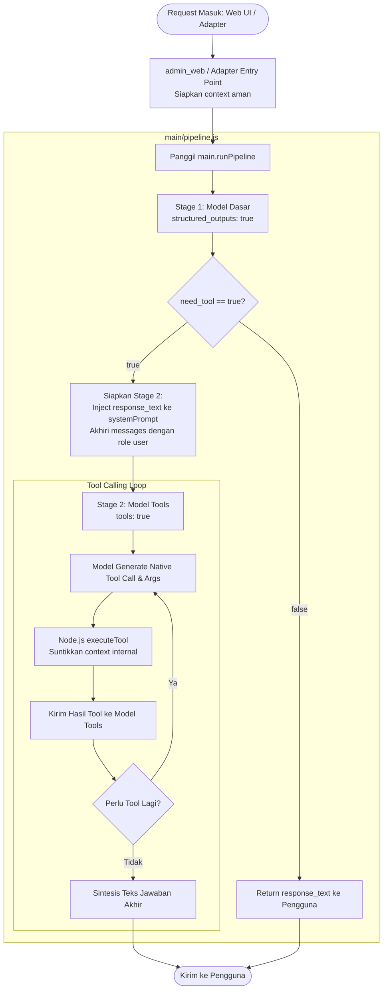

# Dedicated Pipeline Plan: Decoupled Decision & Tool Execution

Dokumen perencanaan dan arsitektur pipeline pemrosesan berbasis kapabilitas model: memisahkan tahap evaluasi kebutuhan perkakas (*decision*) menggunakan model dasar berkapabilitas `structured_outputs`, dengan tahap eksekusi perkakas (*tool calling loop*) menggunakan model yang memiliki kapabilitas `tools`.

---

## 1. Konsep Dasar

1. **Model Dasar (`structured_outputs: true`)**:
   - Tidak semua model yang bisa menghasilkan output terstruktur memiliki kapabilitas native function calling (*tools*).
   - Semua model teks yang mendukung `structured_outputs` diperlakukan sebagai model paling dasar (**Decider / Pemutus**).
   - Tugasnya: mengevaluasi prompt dan konteks percakapan untuk memutuskan apakah sistem perlu memanggil tool (`need_tool: true`), serta dapat menghasilkan teks tanggapan awal (`response_text`).
2. **Eskalasi ke Model Tools (`tools: true`)**:
   - Jika model dasar memutuskan butuh tool (`need_tool: true`), pipeline memicu model yang memiliki kapabilitas `tools`.
   - Model kedua inilah yang melakukan *native tool calling*: memilih tool, mengisi parameter, menerima output eksekusi dari Node.js, dan melakukan perulangan (*looping*) hingga jawaban final tercapai.
3. **Pemisahan Peran Parameter vs. Context**:
   - **`args` (Parameter dari AI)**: Data yang dihasilkan oleh model sesuai skema tool.
   - **`context` (Sistem Node.js)**: Sumber daya internal (`targetChatId`, `storage`, `adapters`) yang disuntikkan langsung oleh sistem dan tidak pernah terlihat oleh model AI.

---

## 2. Alur Pipeline (Workflow)



---

## 3. Struktur Modul & Skrip (`aichan/main/`)

```text
aichan/
├── admin_web/
│   └── index.js            # Entry point HTTP: siapkan context & panggil pipeline
└── main/
    ├── index.js            # Export lifecycle, storage, dan runPipeline
    ├── pipeline.js         # Orkestrator: Stage 1 Decider -> Stage 2 Tool Loop
    └── tools/
        ├── index.js        # Facade: export listToolSchemas, executeTool
        ├── registry.js     # Penyimpanan definisi tool
        └── definitions/    # Folder implementasi tool (SEMUA BERSIFAT PLACEHOLDER)
            ├── time.js     # [PLACEHOLDER / REPLACABLE] Contoh fungsi lokal murni
            ├── notify.js   # [PLACEHOLDER / REPLACABLE] Contoh fungsi dispatch dengan context
            └── instance.js # [PLACEHOLDER / REPLACABLE] Contoh fungsi pengendali instance
```

---

## 4. Snippet Implementasi Kode

### A. Entry Point Pemanggil (`admin_web/index.js`)
Menyiapkan `context` aman di sisi server dan meneruskan eksekusi ke `main.runPipeline`:

```javascript
// Di dalam handler POST /api/generate
const context = {
  platform: 'web',
  targetChatId: chat?.chat_id || 'web-playground',
  storage: main,
  adapters: { /* referensi instance adapter telegram, discord, dll */ }
};

const result = await main.runPipeline({
  prompt,
  history,
  deciderModel: targetMod, // Model berkapabilitas structured_outputs
  toolModel: targetMod,    // Model berkapabilitas tools: true
  context
});

res.writeHead(200, { 'Content-Type': 'application/json' });
res.end(JSON.stringify(result));
```

### B. Orkestrator Pipeline (`main/pipeline.js`)
Menjalankan Stage 1, memeriksa kebutuhan tool, lalu mengeksekusi Stage 2 dengan urutan pesan yang valid sesuai protokol API:

```javascript
import { listToolSchemas, executeTool } from './tools/index.js';

// Skema output terstruktur Stage 1
const deciderSchema = {
  type: "object",
  properties: {
    need_tool: { 
      type: "boolean",
      description: "True jika permintaan butuh tool. False jika bisa dijawab langsung."
    },
    response_text: { 
      type: ["string", "null"],
      description: "Teks jawaban langsung (jika need_tool=false) atau tanggapan/penalaran awal (jika need_tool=true)."
    }
  },
  required: ["need_tool"]
};

export async function runPipeline({ prompt, history, deciderModel, toolModel, context = {} }) {
  const tools = listToolSchemas();

  // --- STAGE 1: Model Dasar (structured_outputs) ---
  const decision = await deciderModel.generateStructured({
    prompt,
    history,
    schema: deciderSchema,
    systemPrompt: `Daftar tool yang tersedia: ${JSON.stringify(tools.map(t => t.name))}. Tentukan apakah butuh tool.`
  });

  // Jika tidak butuh tool, langsung kembalikan jawaban
  if (!decision.need_tool) {
    return { text: decision.response_text };
  }

  // --- STAGE 2: Eskalasi ke Model Tools (tools: true) ---
  // Catatan awal Stage 1 disuntikkan ke systemPrompt agar tidak melanggar urutan pesan API
  const systemPrompt = decision.response_text
    ? `Instruksi: Selesaikan permintaan pengguna menggunakan tools yang tersedia. Catatan awal: ${decision.response_text}`
    : `Instruksi: Selesaikan permintaan pengguna menggunakan tools yang tersedia.`;

  // Messages wajib diakhiri dengan role 'user' agar model dapat merespons dengan tool_calls
  let currentMessages = [
    ...history,
    { role: 'user', content: prompt }
  ];

  const maxLoops = 5;
  for (let i = 0; i < maxLoops; i++) {
    const response = await toolModel.generateWithNativeTools({
      systemPrompt,
      messages: currentMessages,
      tools
    });

    // Jika model menghasilkan teks jawaban final (selesai)
    if (response.isFinal) {
      return { text: response.text };
    }

    // Jika model meminta pemanggilan tool
    currentMessages.push({
      role: 'assistant',
      toolCalls: response.toolCalls
    });

    for (const call of response.toolCalls) {
      // Eksekusi tool di Node.js dengan menyuntikkan context internal
      const toolOutput = await executeTool(call.name, call.arguments, context);

      currentMessages.push({
        role: 'tool',
        toolCallId: call.id,
        name: call.name,
        content: JSON.stringify(toolOutput)
      });
    }
  }

  return { text: "Batas iterasi tool tercapai." };
}
```

### C. Eksekusi Tool (`main/tools/index.js`)
Facade penghubung antara panggilan AI dan implementasi lokal di Node.js:

```javascript
import { getTool } from './registry.js';

export async function executeTool(name, args = {}, context = {}) {
  const tool = getTool(name);
  if (!tool) {
    throw new Error(`Tool "${name}" tidak ditemukan.`);
  }

  // args diisi oleh AI, context disuntikkan dari runtime Node.js
  return await tool.execute(args, context);
}
```

---

## 5. Contoh Tool ([PLACEHOLDER / REPLACABLE])

> [!NOTE]
> Semua file di bawah ini adalah placeholder ilustratif untuk membuktikan kesiapan alur penerimaan `args` dan `context`. File-file ini dapat diganti atau dihapus tanpa mengubah logika pipeline.

### A. [PLACEHOLDER] `definitions/time.js` (Stateless Query)
```javascript
// [PLACEHOLDER / REPLACABLE]
export const timeTool = {
  name: "get_current_time",
  description: "Mendapatkan waktu sistem saat ini.",
  parameters: { type: "object", properties: {} },
  async execute() {
    return { timestamp: new Date().toISOString() };
  }
};
```

### B. [PLACEHOLDER] `definitions/notify.js` (Outbound Dispatch dengan Context)
```javascript
// [PLACEHOLDER / REPLACABLE]
export const notifyTool = {
  name: "send_notification",
  description: "Mengirimkan pesan notifikasi ke pengguna saat ini.",
  parameters: {
    type: "object",
    properties: {
      message: { type: "string", description: "Teks pesan notifikasi." }
    },
    required: ["message"]
  },
  async execute(args, context) {
    // args.message berasal dari LLM
    // context.targetChatId berasal dari server Node.js secara aman
    const adapter = context.adapters[context.platform];
    await adapter.sendMessage(context.targetChatId, args.message);

    return { delivered: true, timestamp: Date.now() };
  }
};
```

### C. [PLACEHOLDER] `definitions/instance.js` (Lifecycle Switch dengan Context)
```javascript
// [PLACEHOLDER / REPLACABLE]
export const instanceTool = {
  name: "manage_instance",
  description: "Menyalakan atau mematikan service instance latar belakang (misal: client Minecraft, bot Discord).",
  parameters: {
    type: "object",
    properties: {
      service: { type: "string" },
      action: { type: "string", enum: ["start", "stop"] }
    },
    required: ["service", "action"]
  },
  async execute(args, context) {
    // Memerintahkan modul internal melalui context tanpa menahan thread pipeline
    const serviceAdapter = context.adapters[args.service];
    if (args.action === "start") {
      await serviceAdapter.start();
    } else {
      await serviceAdapter.stop();
    }
    return { service: args.service, status: args.action === "start" ? "running" : "stopped" };
  }
};
```

---

## 6. Status Perencanaan

- [x] Dokumentasi pemisahan Stage 1 (Decider `structured_outputs`) dan Stage 2 (Looping `tools`).
- [x] Penambahan variabel `context` pada seluruh alur eksekusi (`admin_web` -> `pipeline` -> `executeTool` -> `tool.execute`).
- [x] Pembaruan skema decider menjadi `{ need_tool, response_text }`.
- [x] Penyuntikan `response_text` Stage 1 ke `systemPrompt` Stage 2 untuk mematuhi aturan turn order API.
- [x] Pelabelan tegas seluruh tool implementasi sebagai `[PLACEHOLDER / REPLACABLE]`.
- [ ] Implementasi kode saat diminta.
